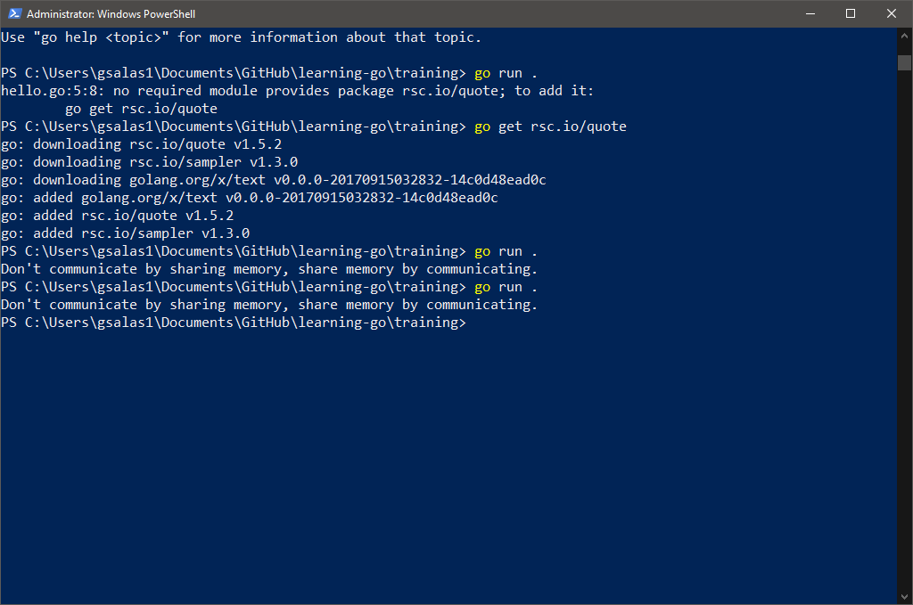

# go.dev getting started guide

## enable dependency tracking for your code

when importing packages contained in other modules, you manage those dependencies through your code's own module. That module is defined by a go.mod file that tracks the modules that provide those packages. That *go.mod* file stays with your code, including in your source code repo.

To enable dependency tracking for your code by creating a *go.mod* file, run:

> go mod init

giving it the name of the module your code will be in. The name is the module's module path. In development, the module path will typically be the repo location where your source code will be kept.

For this example, I'm using the following:

> go mod init training/godev

We'll start with the following code:

### Code and Notes

```go
package main

import "fmt"

func main() {
    fmt.Println("Hello, World!")
}
```

* declar a *main* package (a package is a way to group functions, and it's made up of all the files in the same dir)
* import **fmt** package, which contains functions for formatting text, including printing to the console
    + [standard library functions](https://pkg.go.dev/std)
* implement a **main** function to print a message to the console. A main function executes by default when you run the **main** package.

### Run your code

> go run .

## Call code in an external package

When you need your code to do something that might have been implemented by someone else, you can look for a package that has functions you can use in your code.

We'll spice up the code with [this package](https://pkg.go.dev/rsc.io/quote/v4).

Use the following template to import the *quote* package.

```go
package main

import "fmt"

import "rsc.io/quote"

func main() {
    fmt.Println(quote.Go())
}
```

Don't forget to install the package!



You can add new module requirements and sums. Go will add the quote module as a requirement, as well as a go.sum files for use in authenticating the module.

> go mod tidy

When you run **go mod tidy**, it located and downloaded the rsc.io/quote module that contains the package you imported. By default, it downloaded the lasted version -- v1.5.2

## Create a Go Module

This tutorial's suquence includes seven brief topics that each illustrate a different part of the language.

1. Create a module - write a small module with functions you can call from another module
2. Call your code from another module - import and use your new module
3. Return and handle an error - add simple error handling
4. Return a random greeting - handle data in slices (Go's dynamically-sized arrays)
5. Return greetings for multiple people - store key/value pairs in a map
6. Add a test - Use Go's built-in testing features to test your code
7. Compile and install the application - compile and install your code locally

### greetings.go

Creating a Go module using the *go mod init*, giving it your module path - we will use **example.com/greetings** If you publish a module, this *must* be a path from which your module can be downloaded by Go tools. That would be your codes repo.

```go
package greetings

import "fmt"

// hello returns a greeting for the named person
func Hello(name string) string {
	// return a greeting that embeds the name in a message
	message := fmt.Sprint("Hi,%v. Welcome", name)
	return message
}	
```

In this code, you declare a **greetings** package to collect related functions and implement a Hello function to return the greeting.

This function takes a **name** parameter whose type is string. The function also returns a string. In Go, a function whose name starts with a capital can be called by a function not in the same package. This is known in Go as an exported name.

> func Hello(name string) string

* declare a message variable to hold your greeting

In Go, the := operator is a shortcut for declaring and initializing a variable in one line (Go uses the value on the right to determine the variable's type). Taking the long way, you may have written this as:

```golang
var message string
message = fmt.Sprintf("Hi, %v. Welcome!", name)
```

* Use the fmt package's [Sprintf function](https://pkg.go.dev/fmt/#Sprintf) to create a greeting message. The first argument is a format string, and Sprintf substitutes the name parameter's value for the %v format verb. Inserting the value of the **name** parameter completes the greeting text.
* Return the formatted greeting text to the caller. 

---
